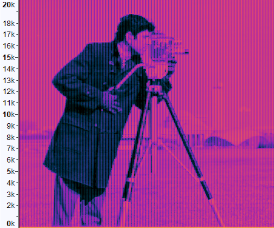

# Embed-Images-In-Sound
MATLAB script to embed images in the frequency domain of sound signals. Can generate both deterministic and random signals. Random signals are generated using autoregressive models calculated using the Yule-Walker equations.

# Examples

  Spectrogram of deterministic output:

  

  Spectrogram of random output:

  

